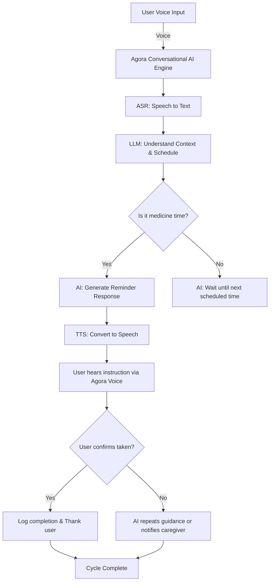
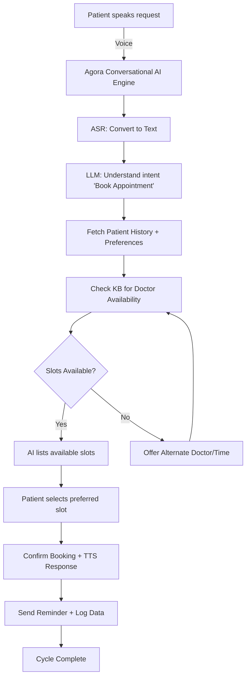

# ey-techathon-fmeg-prototype

## 🤖 Agentic AI System for Automated RFP Response

## 📘 Overview

This project implements an **Agentic AI System** designed to automate and streamline the **Request for Proposal (RFP)** process for large industrial and manufacturing firms.  
The system consists of a **Main Agent (Orchestrator)** and several **Worker Agents** that collaborate to analyze RFPs, identify matching products (OEM SKUs), calculate pricing, and consolidate a final RFP response.

The primary goal is to reduce manual effort in responding to complex RFPs by dividing tasks among specialized AI agents that handle **Sales, Technical Evaluation, and Pricing.**

---

## 🧩 Agent Roles and Responsibilities

### 🧠 Main Agent
- Acts as the **orchestrator** of the conversation and workflow.  
- Summarizes identified RFPs shared by the Sales Agent and sends contextual summaries to the **Technical** and **Pricing Agents**.  
- Receives responses from both agents and **consolidates the final RFP response** containing:
  - ✅ OEM Product SKUs  
  - 💰 Price & Cost for materials and tests  
- Starts and ends each conversation (serves as the **chatbot interface**).  

---

### 💼 Sales Agent
- Identifies **RFPs due for submission within the next 3 days**.  
- Scans URLs to **summarize RFPs** and extract key deadlines.  
- Selects one RFP for response and sends it to the **Main Agent**.  

---

### ⚙️ Technical Agent
- Receives the **RFP summary and document** from the Main Agent.  
- Summarizes the **products in the Scope of Supply**.  
- Performs **Specification Matching (Spec Match %)** to:
  - Recommend the **Top 3 OEM products** for each product in the scope.  
  - Compare specifications using a weighted equality metric (all specs equally weighted).  
- Produces:
  - 🧾 A comparison table of RFP spec requirements  
  - 🏷️ A final table of recommended OEM product SKUs  
- Sends the final table to both the **Main Agent** and the **Pricing Agent**.  

---

### 💵 Pricing Agent
- Receives:
  - Summary of tests & acceptance criteria from the Main Agent  
  - Recommended OEM product table from the Technical Agent  
- Assigns:
  - Unit prices for each product (using a **dummy pricing table**)  
  - Service/test prices (using a **dummy service price table**)  
- Consolidates total **Material + Service costs** for each product in the scope.  
- Sends the **final consolidated price table** back to the **Main Agent** for inclusion in the overall RFP response.  

---

## 🧠 End-to-End Workflow
1. **Sales Agent** identifies RFPs and sends one to the **Main Agent**.  
2. **Main Agent** shares contextual summaries with **Technical** and **Pricing Agents**.  
3. **Technical Agent** matches specifications and recommends top OEM SKUs.  
4. **Pricing Agent** assigns costs and consolidates pricing.  
5. **Main Agent** merges all responses into the **final RFP proposal**.  

---

## 🚀 Run the API locally

The app uses FastAPI. You can run it with the built-in FastAPI server (included in `fastapi[standard]`).

```powershell
# From the project root
uvicorn main:app --reload --host 0.0.0.0 --port 8000
```

Interactive docs will be available at:
- http://localhost:8000/docs
- http://localhost:8000/redoc

Optional: set a different Ollama model name via environment variable before running:

```powershell
$env:OLLAMA_MODEL = "llama3.1"; uvicorn main:app --reload
```

Ensure you have Ollama running locally with the model you configured.

---

## 📡 API quickstart

Example payloads for key endpoints:

1) Identify RFPs (Sales)

POST /sales/identify

```json
{
  "sources": ["https://example.com/rfp-123"],
  "due_within_days": 3
}
```

2) Recommend OEM SKUs (Technical)

POST /technical/recommend

```json
{
  "rfp": {"id": "rfp-123", "title": "Sample RFP"},
  "scope": [
    {
      "item_id": "itm-1",
      "description": "Medium voltage control panel",
      "specs": [{"name": "Voltage", "value": "11kV"}]
    }
  ]
}
```

3) Price recommendations (Pricing)

POST /pricing/price

```json
{
  "recommendations": [
    {
      "scope_item_id": "itm-1",
      "candidates": [{"sku": "OEMX-CTRL-11KV-A", "oem": "OEMX", "match_score": 0.86}]
    }
  ],
  "tests": ["Factory Acceptance Test"]
}
```

4) Full orchestration (Main)

POST /main/orchestrate

```json
{
  "sources": ["https://example.com/rfp-123"],
  "scope": [
    {"item_id": "itm-1", "description": "MV Panel", "specs": []}
  ],
  "tests": ["FAT"]
}
```

All endpoints will return structured JSON responses using Pydantic models.

---

## 🧭 Contributor Guide

Follow these steps if you want to contribute to this repository using the correct Git workflow.

---

### 🪄 1. Fork the Repository
- Go to the main repository on GitHub.
- Click **“Fork”** (top-right corner).
- This creates a personal copy of the repo under your GitHub account.

---

### 💻 2. Clone Your Fork
```bash
git clone https://github.com/<your-username>/<repo-name>.git
cd <repo-name>
```

This downloads your fork to your local machine.

---

### 🌿 3. Create a Feature Branch

Create a new branch for your feature or fix:

```bash
git checkout -b feature/your-feature-name
```

Example:

```bash
git checkout -b feature/technical-agent-spec-match
```

---

### 📝 4. Make Changes and Commit

After editing files, stage and commit your changes:

```bash
git add .
git commit -m "✨ Added Spec Match logic for Technical Agent"
```

Use meaningful commit messages that describe what you changed.

---

### 🔄 5. Sync Your Fork’s `main` with the Original Repo

First, add the original repository as an **upstream** remote (only once):

```bash
git remote add upstream https://github.com/<original-owner>/<repo-name>.git
```

Fetch the latest changes:

```bash
git fetch upstream
```

Update your local `main` branch:

```bash
git checkout main
git merge upstream/main
```

Push the updated main to your fork:

```bash
git push origin main
```

---

### 🔀 6. Merge Feature Branch into Your Updated Main

Switch to your feature branch:

```bash
git checkout feature/your-feature-name
```

Merge the updated main into your branch to ensure compatibility:

```bash
git merge main
```

Resolve any merge conflicts, then:

```bash
git add .
git commit
```

Now merge your feature branch back into your fork’s main:

```bash
git checkout main
git merge feature/your-feature-name
git push origin main
```

---

### 🚀 7. Create a Pull Request (PR)

* Go to your fork on GitHub.
* Click **“Compare & Pull Request”**.
* Add a clear title and description for your PR (see example below):

```markdown
## ✨ Feature: Technical Agent Spec Match Logic

- Added functionality for spec-based OEM product matching.
- Integrated dummy product dataset for testing.
- Returns top 3 OEM products for each scope item with spec match %.
```

Then click **“Create Pull Request”** ✅

---

## 📦 Folder Structure

```
agentic-rfp-system/
│
├── backend/
│   ├── agents/
│   │   ├── main_agent.py
│   │   ├── sales_agent.py
│   │   ├── technical_agent.py
│   │   └── pricing_agent.py
│   ├── data/
│   │   ├── dummy_pricing_table.csv
│   │   └── dummy_services_table.csv
│   ├── utils/
│   │   └── spec_matcher.py
│   └── templates/
│       └── rfp_response_template.json
│
└── README.md
```

---

## 🧪 Future Enhancements

* 🧩 Integration with real OEM data APIs
* 📊 Visualization dashboard for RFP summaries
* 🤝 Multi-agent coordination through LangGraph or CrewAI

---

## 💬 Maintainer

**Team:**
- Caleb Chandrasekar 
- S. Tharundhatri
- Sarvesh Chandran

For questions or suggestions, please open an **Issue** or start a **Discussion**.

---

⭐ If you found this project useful, don’t forget to **star the repo**!


Here are **two Mermaid loop diagrams** (integrated with the Agora Conversational AI Engine structure you showed):

---

### 🌀 Cycle 1 – Elderly Medicine Reminder Flow



---

### 🩺 Cycle 2 – Patient Slot Booking Flow



---

Would you like me to extend these with **Agora module labels** (e.g., ASR, LLM, TTS, Network Routing, etc.) to match the architecture shown in your image?

